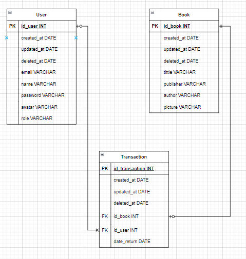
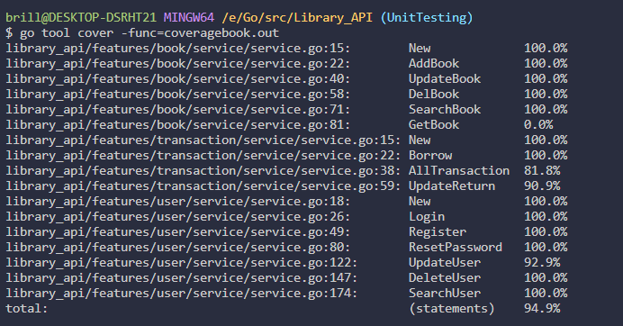

# Simply_API


The Library Management System is a simple library management application that allows library administrators to manage the book catalog and members, facilitating book borrowing and return by members.

## Key Features

- Registration and management of library members.
- Management Users, Books
- Book catalog with detailed information.
- Book borrowing and return functionality.
- Book search by title

## Technologies Used

- Programming Language: Go
- Database: MySQL
- Framework: Echo

## Run Locally

Clone the project

```bash
git clone https://github.com/fauzibrillian/Simply_API.git
```

Go to the project directory

```bash
cd Simply_API
```

Install dependency

```bash
go mod tidy
```

## Cloudinary API Key

Ensure you have an Cloudinary API key for accessing storage file. Add the API key to your configuration file.

## ERD


## API

<summary>Admin</summary> 
<div>
  
| Feature User | Endpoint | Param | JWT Token | Function |
| --- | --- | --- | --- | --- |
| GET | /users | - | + | Get and Search all user. |
| PATCH | /user/{id} | User ID | + | Update user by id. |
| DELETE | /user/{id} | User ID | + | Displaying Group detail 
| GET | /transactions | - | + | Get all transaction. |
| POST | /books  | - | + | Post books. |
| PATCH | /books/{id} | books ID | + | Update books |
| DELETE | /books/{id} | books ID | + | Delete books |


</details>

<div>
      <details>
<summary>User</summary>
  
  <!---
  | Command | Description |
| --- | --- |
  --->
 
<div>
  
| Feature Groups | Endpoint | Param | JWT Token | Function |
| --- | --- | --- | --- | --- |
| POST | /login  | - | - | Login. |
| POST | /register | - | - | Register. |
| PATCH | /user/{id} | User ID | + | Update user by id. |
| PATCH | /resetpassword/{id} | User ID | + | Reset Password user by id. |
| DELETE | /user/{id} | User ID | + | Displaying Group detail by id. |

</details>

<div>
      <details>
<summary>Book</summary>
  
  <!---
  | Command | Description |
| --- | --- |
  --->
 
<div>
  
| Feature Chats | Endpoint | Param | JWT Token | Function |
| --- | --- | --- | --- | --- |
| GET | /books/{id}  | book ID | - | Get book. |
| GET | /books  | Name book | - | Get and Search All book. |


</details>

<div>
      <details>
<summary>Borrow</summary>
  
  <!---
  | Command | Description |
| --- | --- |
  --->
  
Several commands make use of Locations features, as shown below.
 
<div>
  
| Feature Locations | Endpoint | Param | JWT Token | Function |
| --- | --- | --- | --- | --- |
| POST | /transactions  | - | + | Checkout borrow books. |
| PATCH | /transactions/{id}  | transaction id | + | Return date. |


</details>


# Unit Testing

